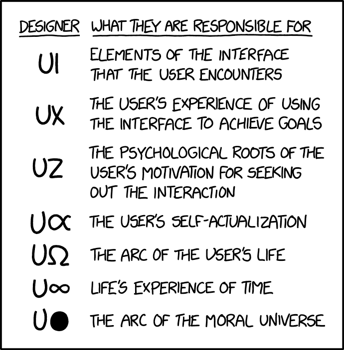

# Theory
## WHY - 1
> Building a game means building a theory first. Theory for what? for fun. The purpose of this game is to be an **emulator to stress, health and senses**.

While envisioning something might be trivial, building it while preserving the vision is nearly an uneneding-game.

# Ideas:
- User is the creator (creator age is restricted to 0).
- Creator needs no tools at inception just ideas based on their calibre
- Cretor Judges calibre through Mathematics: geometry, numbers, words

### State logic:
* frame0 + frame1(overwrite) = current frame

## Current challenges: 
1. Implement an engine that dynamically produces required art:
   a. elements of art is based on geometry

### TO-DO
- ~~add state to screen.c for frame~~
- add wiremesh engine (preferably rust-lang)
- create engine for voxel creation (bw)
> #note: 
    1. Choice creates Psyche which is just a tree <3
    2. EI="perceive, understand, and manage emotions for better decision-making and relationships." 

see:- https://docs.rust-embedded.org/book/interoperability/c-with-rust.html
   -  https://github.com/EvanCMcPheron/Ascii-Renderer

# Bibliography
* https://www.americanscientist.org/sites/americanscientist.org/files/2013416124139665-2013-05Hayes.pdf
